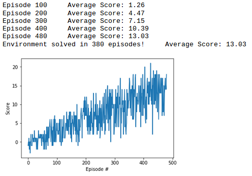

## Learning algorithm

Owing to the discrete action space, DQN algorithm has been used for this project.

## Network acrhitecture
* A network with two hidden layers was used with relu activation. Each layer comprised of 64 nodes.

## Hyperparameters

Following hyperparameters were used to train the agent.
* BUFFER_SIZE = int(1e5)  
* BATCH_SIZE = 64         
* GAMMA = 0.99            
* TAU = 1e-3              
* LR = 5e-4               
* UPDATE_EVERY = 4        

## Reward plot
Following reward plot was obtained when the agent was trained.

## Ideas to improve the performance of the agent
* Further experimentation will be done with the agent using the Prioritized Experience Replay technique. 
* Agent will also be trained by taking direct screen pixels as the input.